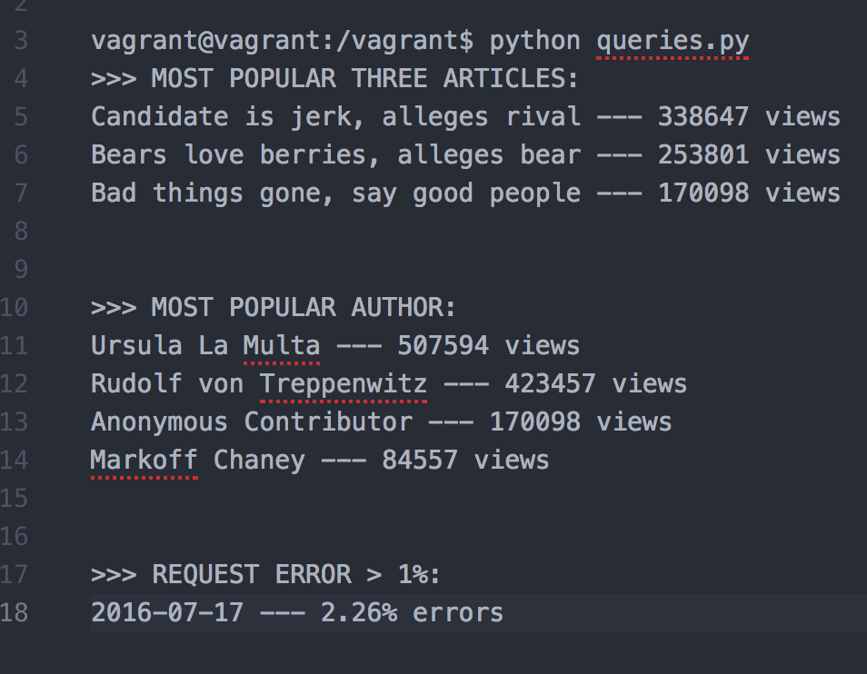

—————————————

INTRODUCTION:

—————————————

PROJECT: Logs Analysis Project

DESCRIPTION: Collects and sorts the information specified for the project

AUTHORS: Steven Huynh


———————————————————————

OPERATING INSTRUCTIONS:

———————————————————————

Setting up your VM environment:


Running the program:


# Log Analysis
Searches up the following queries from the provided database

## Installation

#### Setting up your VM environment:
1) Install VirtualBox version 5.1 (Oct 2017) for most stable use: https://www.virtualbox.org/wiki/Download_Old_Builds_5_1
2) Install Vagrant: https://www.vagrantup.com/downloads.html
3) Download the VM configuration into a folder you plan to hold the project: https://github.com/udacity/fullstack-nanodegree-vm
4) Navigate to the vagrant folder from the repository through the terminal
5) Type 'vagrant up'. If it doesn't work , do 'vagrant init' then try again.

```linux
vagrant init
vagrant up
```

6) Type 'vagrant ssh'. Setup complete.

```linux
vagrant ssh
```
7) Navigate to the vagrant folder within the virtual environment after logging in

```linux
cd /vagrant
```

#### Running the program:
1) Navigate to the project folder within your VM environment.
2) In your VM, make sure the file newsdata.sql is there and then type 'psql -d news -f newsdata.sql'. The sql file can be found through the following link: [HERE](https://d17h27t6h515a5.cloudfront.net/topher/2016/August/57b5f748_newsdata/newsdata.zip)


Connect to the database with 'psql -d news'

```linux
psql -d news -f newsdata.sql
psql -d news
```

3) Enter a new VM environment with another terminal

```linux
vagrant ssh
cd /vagrant
```
Navigate to the project folder in the VM and run 'python queries.py'

```linux
python queries.py
```

## Usage Example


## Author
Steven Huynh


[Linkedin](https://www.linkedin.com/in/stevenhuynh17/)
